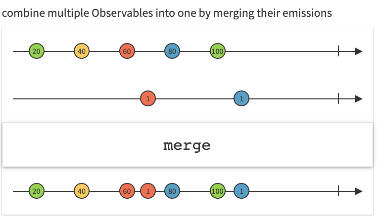
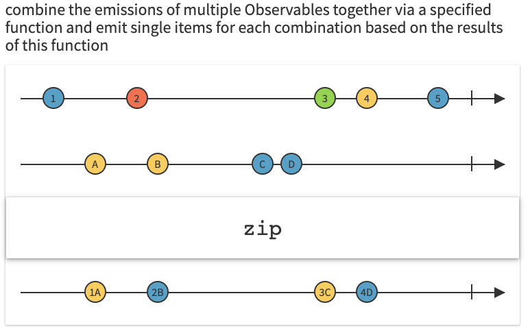
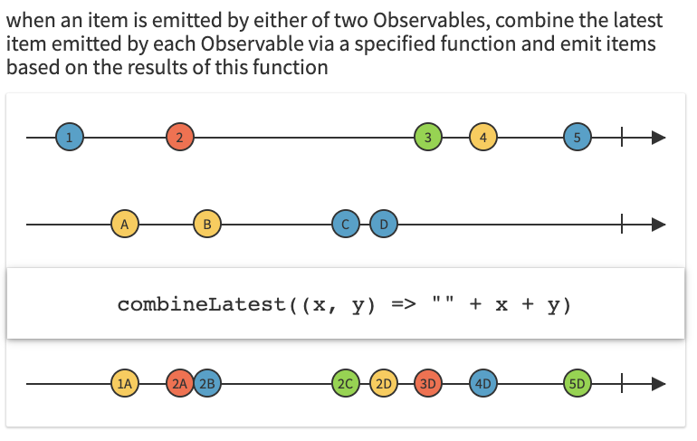
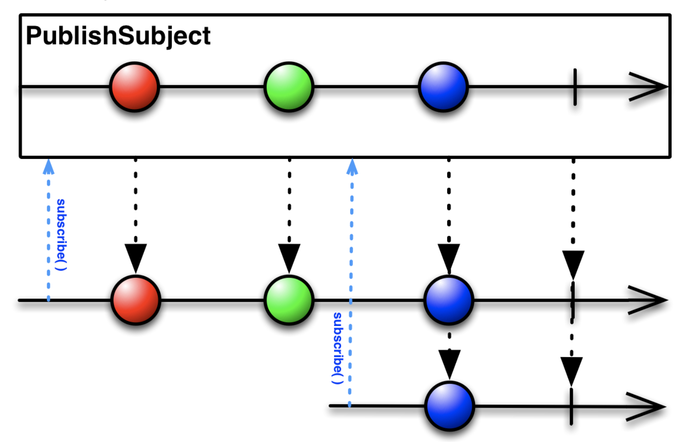
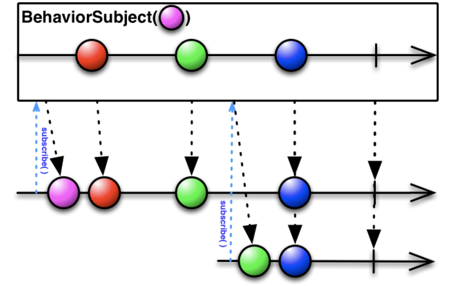
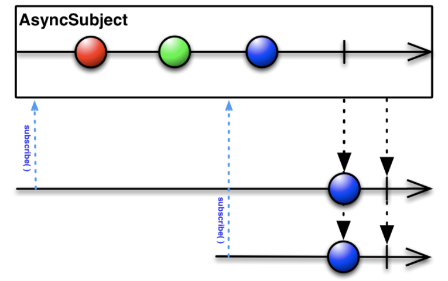
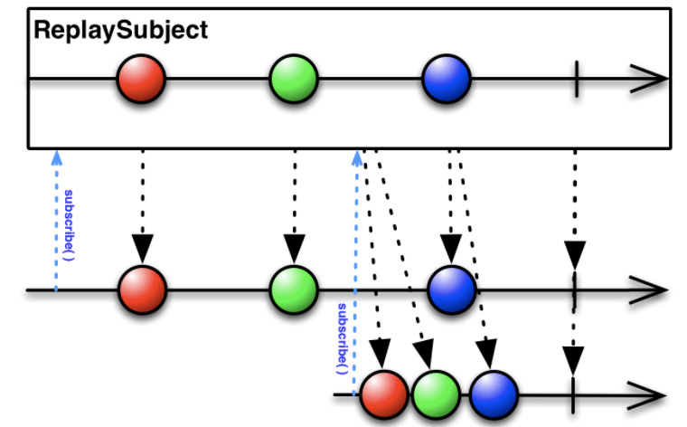

# RxSwift+MVVM 4시간에 끝내기 시즌2

[곰튀김 님의 RxSwift 4시간에 끝내기 (시즌2)](https://github.com/iamchiwon/RxSwift_In_4_Hours)를 듣고 정리한 내용입니다. ([유튜브 링크](https://www.youtube.com/channel/UCsrPur3UrxuwGmT1Jq6tkQw))


RxSwift는 Swift에 ReactiveX를 적용시켜 비동기 프로그래밍을 직관적으로 작성할 수 있도록 도와주는 라이브러리이다.


## [1교시] 개념잡기 - RxSwift를 사용한 비동기 프로그래밍

아래 코드를 실행하면 `loadButton` 을 눌렀을 때 `timerLabel` 이 멈추고, `activityIndicator` 가 보여지지 않고, `editView` 에 다운로드된 json 결과값이 표시된다.

```swift
@IBAction func onLoad() {
    editView.text = ""
    setVisibleWithAnimation(activityIndicator, true)

    let url = URL(string: MEMBER_LIST_URL)!
    let data = try! Data(contentsOf: url)
    let json = String(data: data, encoding: .utf8)
    self.editView.text = json
        
    self.setVisibleWithAnimation(self.activityIndicator, false)
}
```


왜 그럴까?

동기화로 작업이 되어있어서 json을 다운받는 작업을 진행하는 동안은 타이머를 컨트롤 하지 않기 때문.


`timerLabel` 이 멈추지 않고, 

`activityIndicator` 가 버튼 옆으로 보여지도록 수정해보자.

```swift
@IBAction func onLoad() {
    editView.text = ""
    setVisibleWithAnimation(activityIndicator, true)

    DispatchQueue.global().async {
        let url = URL(string: MEMBER_LIST_URL)!
        let data = try! Data(contentsOf: url)
        let json = String(data: data, encoding: .utf8)
        
        DispatchQueue.main.async {
            self.editView.text = json   
            self.setVisibleWithAnimation(self.activityIndicator, false)
        }
    }
}
```

→ 현재 내가 진행하고 있는 작업과 동시에, 다른 스레드에서(멀티 스레드) 다른 작업을 수행한 후 그 결과를 비동기적으로 받아서 처리한다.

 

네크워킹 부분만 따로 분리해보자.

```swift
func downloadJson(_ url: String, _ completion: @escaping (String?) -> Void) {
    DispatchQueue.global().async {
        let url = URL(string: url)!
        let data = try! Data(contentsOf: url)
        let json = String(data: data, encoding: .utf8)
        DispatchQueue.main.async {
            completion(json)
        }
    }
}
```

→ `@escaping` 이 필요한 이유: 본체 함수가 끝나고 나서 나중에 실행되는 함수에 적어준다. 전달되는 내용들, 즉 클로저의 역할인 캡쳐를 수행한다.


이것이 일반적인 Swift의 비동기 처리 방법이다. 그러나 이러한 방법의 단점은 다음과 같다.

1. 복잡하다.
2. 중첩된 동작에서 에러 처리 등을 수행하기 용이하지 않다.


그렇다면 좀 더 사용이 편하도록

`completion` 이 아닌 리턴 값으로 전달할 수는 없을까?


그래서 고안한 방법이 다음과 같다.

```swift
class 나중에생기는데이터<T> {
    private let task: (@escaping (T) -> Void) -> Void
    
    init(task: @escaping (@escaping (T) -> Void) -> Void) {
        self.task = task
    }
    
    func 나중에오면(_ f: @escaping (T) -> Void) {
        task(f)
    }
}
```

`나중에생기는데이터` 를 생성하면서 클로저를 받아서 `task` 에 가지고 있다가, 

`나중에오면` 이라는 메소드가 실행될 때 저장해뒀던 클로저 `task`를 실행하면서, 

지금 들어온 클로저 `f`를 전달해주면 나중에 전달이 되는 원리이다.

```swift
func downloadJson(_ url: String) -> 나중에생기는데이터<String?> {
    return 나중에생기는데이터() { f in
        DispatchQueue.global().async {
            let url = URL(string: url)!
            let data = try! Data(contentsOf: url)
            let json = String(data: data, encoding: .utf8)
                
            DispatchQueue.main.async {
                f(json)
            }
        }
    }
}

@IBAction func onLoad() {
    editView.text = ""
    setVisibleWithAnimation(activityIndicator, true)
        
    let json: 나중에생기는데이터<String?> = downloadJson(MEMBER_LIST_URL)

    json.나중에오면 { json in
        self.editView.text = json
        self.setVisibleWithAnimation(self.activityIndicator, false)
    }
}
```


이는 RxSwift와 형태와 사용방법이 같다.

RxSwift는 비동기로 생기는 결과값을 completion이 아니라 리턴 값으로 전달하기 위해서 만들어진 유틸리티


### 1. Observable

```swift
func downloadJson(_ url: String) -> Observable<String?> {
    // 1. 비동기로 생기는 데이터를 Observable로 감싸서 리턴하는 방법
    return Observable.create { f in
        DispatchQueue.global().async {
            let url = URL(string: url)!
            let data = try! Data(contentsOf: url)
            let json = String(data: data, encoding: .utf8)
              
            DispatchQueue.main.async {
                f.onNext(json)
                f.onCompleted() // 순환 참조 문제 해결
            }
        }
        return Disposables.create()
    }
}

@IBAction func onLoad() {
    editView.text = ""
    setVisibleWithAnimation(activityIndicator, true)
      
    // 2. Observable로 오는 데이터를 받아서 처리하는 방법
    // let disposable =
    downloadJson(MEMBER_LIST_URL)
        .subscribe { event in
            switch event {
            case let .next(json):
                self.editView.text = json
                self.setVisibleWithAnimation(self.activityIndicator, false)
            case .completed:
                break
            case .error(_):
                break
            }
        }
//    disposable.dispose()
}
```

### 2. Sugar API

```swift
// just
return Observable.just("Hello World") // String
return Observable.just(["Hello", "World"]) // [String]
// from
return Observable.from(["Hello", "World"]) // String
// subscribe - $0
.subscribe(onNext: { print($0) })

// operator
// map
.map { json in json?.count ?? 0 }
// filter
.filter { cnt in cnt > 0 }
.map { "\($0)" }
```

Docs > Operator 에 자세히 나와있음 - [http://reactivex.io/](http://reactivex.io/) 

마블 다이어그램을 통해 동작이 설명되어 있어 이해하기 좋다.


## [2교시] RxSwift 활용하기 - 쓰레드의 활용과 메모리 관리

### 1. Observable의 생명주기

1. Create - 생성
2. Subscribe - 실행
3. onNext - 데이터 전달
4. onCompleted / onError - 완료 / 에러
5. Disposed - 모든 동작이 완료 또는 작업 취소

---- 끝 ---- - 끝난 Obsevable은 재사용할 수 없음


### 2. 순환참조와 메모리 관리

```swift
f.onNext(json)
f.onCompleted() // 순환 참조 문제 해결
```

- 클로저와 메모리 해제 실험: [https://iamchiwon.github.io/2018/08/13/closure-mem/](https://iamchiwon.github.io/2018/08/13/closure-mem/)

  클로저가 사라지면 클로저가 들고 있던 레퍼런스 카운트도 같이 내려 놓는 것에 대한실험

```swift
override func didMove(toParentViewController parent: UIViewController?) {
    super.didMove(toParentViewController: parent)
    if parent == nil { disposeBag = DisposeBag() }
}
```

### 3. 스레드 분기

```swift
// observeOn
.observeOn(MainScheduler.instance)
// subscribeOn
.subscribeOn(ConcurrentDispatchQueueScheduler(qos: .default))
```


### 4. Stream의 분리 및 병합

Combining Obsevables: `merge`, `zip`, `combineLastest`

- `merge` : 타입이 같은 데이터를 하나로 합친다.




- `zip` : 각각의 데이터 타입이 달라도 상관없이, 데이터가 생성되면 하나씩 쌍으로 만든다. 하나씩 대응이 되는 구조이다.



```swift
let jsonObservable = downloadJson(MEMBER_LIST_URL)
let helloObservable = Observable.just("Hello World")
         
_ = Observable.zip(jsonObservable, helloObservable) { $1 + "\n" + $0 }
    .observeOn(MainScheduler.instance)
    .subscribe(onNext: { json in
        self.editView.text = json
        self.setVisibleWithAnimation(self.activityIndicator, false)
    })
```


- `combineLastest` : 가장 최근의 값과 함께 쌍을 만든다.




---

### 1,2교시 정리

- 비동기로 생성된 데이터를 취급하기 위해서 completion을 통해 전달했음
- completion이 아니라 리턴값으로 전달하고 싶음
- 나중에 생기는 데이터로 감싸서 전달함
- 이런 방식의 유틸리티: Promise, Bolt, RxSwift
- RxSwift에서 나중에 생기는 데이터의 이름은 `Observable` 이고, `Observable` 의 데이터를 꺼내 쓰려면 `subscribe` 하면 됨
- `Observable` 만드는 방법, `subscribe` 하는 방법 이 2가지를 알아야 함
  - `Observable` 만드는 방법
    - `Observable.create` 를 호출해서 `emitter` 에 next data를 전달
    - 적절한 시점에 error 처리
    - 동작이 끝났을 때, 취소시키거나 취소 당했을 때 complete 혹은 `task.cancel()`
  - `subscribe` 하는 방법
    - `event` 제어를 통해 `onNext`, `onError`, `onCompleted` 를 적절하게 처리
- sugar 들을 통해 간결한 코드 작성 가능 - operator
  - 생성: `just`, `from`
  - 데이터 조작, 필터링
  - 스레드 제어
  - `subscribe` 시 이벤트 제어가 아니라 취급하고 싶은 이벤트만 지정해서 사용할 수도 있음
  - `return` 값으로 `Disposable` 이 오는데 이는 취소하고 싶은 동작이 있을 때 `disposable.dispose()` 을 호출해주면 동작을 취소시킬 수 있다.

```swift
// 여러 개의 동작들을 dispose 하는 법
// 1. 프로퍼티 생성
var disposable: [Disposable] = []
// 2. Observable의 리턴값 Disposable을 프로퍼티에 넣어주기
let d = Obsevable.just("Hello World")
disposable.insert(d)
// 3. dispose()
disposable.forEach { $0.dispose() }

// sugar
// 1. 프로퍼티 생성
var disposeBag = DisposeBag()
// 2. DisposeBag에 넣어주기
Obsevable.just("Hello World")
  .disposed(by: disposeBag)
```

---


## [3교시] RxSwift 활용범위 넓히기 - UI 컴포넌트와의 연동

백엔드와 디자인의 작업이 끝날 때 까지 기다리지 않고, 백엔드, 디자인, iOS 클라이언트 동시에 개발할 수 없을까?

### 1. Subject

Observable은 어떤 데이터를 내보내야 할지 미리 정해져 있는 형태의 Stream이다.

추가적으로 런타임에 외부 컨트롤에 의해서 데이터가 동적으로 생성되지 않는다. 

따라서 데이터를 넣어줄 수도 있고(`onNext`), 그것을 구독할 수도 있는(`subscribe`) 양방향성을 가진 형태가 필요한데,

이게 바로 Subject로, 받아온 값을 외부에서 컨트롤할 수 있도록 해준다.

- PublishSubject



Subject에 `subscribe()` 하면 내부에서 데이터가 생성되고 그 데이터를 그대로 보내준다. 새롭게 `subscribe()` 할 수도 있다. subscribe 하고 있는 모든 곳에 데이터를 보낸다. 


- BehaviorSubject



기본값 하나를 가지고 시작하여 데이터가 아직 생성되지 않았을 때 `subscribe()` 하자마자 기본 값을 준다. 데이터가 생성되면 데이터를 보내주고, 새롭게 `subscribe()` 하게 되면 가장 최근에 발생했던 값을 내려주고 이후에 발생하는 데이터를 보내준다. 


- AsyncSubject



completed 되는 시점에 가장 마지막에 있던 것을 `subscribe()` 하는 곳에 모두 보내준다.


- ReplaySubject



PublishSubject와 유사하지만 다른 점은 새롭게 `subscribe()` 할 때 여태까지 발생한 모든 데이터를 한꺼번에 다 내려준다는 점이다.


### 2. RxCocoa

RxSwift 기능을 UIKit에 Extension으로 추가한 것


- UI 작업의 특징

1. 항상 UI Thread에서만 동작해야 한다.
2. 순환 참조가 일어날 수 있다.
3. 에러가 나면 Stream이 끊어져 버려서 더 이상 눌러도 동작하지 않을 수 있다. 따라서 Stream이 끊어지지 않아야 한다.

```swift
viewModel.itemsCount
            .map { "\($0)" }
            // 2. error control
            .catchErrorJustReturn("")
            // 1. main thread
            .observeOn(MainScheduler.instance)
            .bind(to: itemCountLabel.rx.text)
            .disposed(by: disposeBag)
```

이를 처리하기 위해 Driver를 제공한다.

```swift
viewModel.itemsCount
            .map { "\($0)" }
            // 2. error control
            .asDriver(onErrorJustReturn: "")
            // 1. main thread
            .drive(itemCountLabel.rx.text)
            .disposed(by: disposeBag)
```


- RxRelay

subject도 stream이 끊어지지 않을 필요가 있다. (UI와 연결되어 있는 경우 등) 

```swift
self.menuObservable.onNext($0)
```

이럴 경우 Relay를 사용한다.

```swift
self.menuObservable.accept($0)
```


- PuplishSubject

```swift
struct Menu {
    var name: String
    var price: Int
    var count: Int
}
```

```swift
class MenuListViewModel {
    
    var menus: [Menu] = [
        Menu(name: "튀김1", price: 100, count: 0),
        Menu(name: "튀김1", price: 100, count: 0),
        Menu(name: "튀김1", price: 100, count: 0),
        Menu(name: "튀김1", price: 100, count: 0)
    ]
    
    lazy var menuObsevable = Observable.just(menus)
    
    var itemsCount: I = 5
    var totalPrice: PublishSubject<Int> = PublishSubject() 
}
```

```swift
class MenuViewController: UIViewController {
    // MARK: - Life Cycle
    
    let viewModel = MenuListViewModel()
    var disposeBag = DisposeBag()

    override func viewDidLoad() {
        super.viewDidLoad()
        
        viewModel.totalPrice
            .scan(0, accumulator: +)
            .map { $0.currencyKR() }
            .subscribe(onNext: {
                self.totalPrice.text = $0
            })
            .disposed(by: disposeBag)
    }

    @IBAction func onOrder(_ sender: UIButton) {
        viewModel.totalPrice.onNext(100)
    }
}

extension MenuViewController: UITableViewDataSource {
    func tableView(_ tableView: UITableView, numberOfRowsInSection section: Int) -> Int {
        return viewModel.menus.count
    }

    func tableView(_ tableView: UITableView, cellForRowAt indexPath: IndexPath) -> UITableViewCell {
        let cell = tableView.dequeueReusableCell(withIdentifier: "MenuItemTableViewCell") as! MenuItemTableViewCell

        let menu = viewModel.menus[indexPath.row]
        cell.title.text = menu.name
        cell.price.text = "\(menu.price)"
        cell.count.text = "\(menu.count)"

        return cell
    }
}
```


- BehaviorSubject

```swift
class MenuListViewModel {
    var menuObservable = BehaviorSubject<[Menu]>(value: [])
    
    lazy var itemsCount = menuObservable.map {
        $0.map { $0.count }.reduce(0, +)
    }
    lazy var totalPrice = menuObservable.map {
        $0.map { $0.price * $0.count }.reduce(0, +)
    }

    init() {
        let menus: [Menu] = [
            Menu(name: "튀김1", price: 100, count: 0),
            Menu(name: "튀김1", price: 100, count: 0),
            Menu(name: "튀김1", price: 100, count: 0),
            Menu(name: "튀김1", price: 100, count: 0)
        ]
        
        menuObservable.onNext(menus)
    }

    func clearAllItemSelections() {
        _ = menuObservable
            .map { menus in
                menus.map { m in
                    Menu(name: m.name, price: m.price, count: m.count)
                }
            }
            .take(1)
            .subscribe(onNext: {
                self.menuObservable.onNext($0)
            })
    } 
}
```

```swift
class MenuViewController: UIViewController {
    // MARK: - Life Cycle
    
    let cellId = "MenuItemTableViewCell"

    override func viewDidLoad() {
        super.viewDidLoad()
        
        viewModel.menuObservable
            .observeOn(MainScheduler.instance)
            .bind(to: tableView.rx.items(cellIdentifier: cellId, cellType: MenuItemTableViewCell.self)) { index, item, cell in
                
                cell.title.text = item.name
                cell.price.text = "\(item.price)"
                cell.count.text = "\(item.count)"
                
            }
            .disposed(by: disposeBag)
        
        viewModel.itemsCount
            .map { "\($0)" }
            .observeOn(MainScheduler.instance)
            .bind(to: itemCountLabel.rx.text)
            .disposed(by: disposeBag)
        
        viewModel.totalPrice
            .map { $0.currencyKR() }
            .observeOn(MainScheduler.instance)
            .bind(to: totalPrice.rx.text)
            .disposed(by: disposeBag)
    }

    @IBAction func onClear() {
        viewModel.clearAllItemSelections()
    }

    @IBAction func onOrder(_ sender: UIButton) {
        viewModel.menuObservable.onNext([
            Menu(name: "changed", price: Int.random(in: 100...1_000), count: Int.random(in: 0...3)),
            Menu(name: "changed", price: Int.random(in: 100...1_000), count: Int.random(in: 0...3)),
            Menu(name: "changed", price: Int.random(in: 100...1_000), count: Int.random(in: 0...3))
        ])
    }
}
```


- api networking

```swift
class APIService {
    static func fetchAllMenusRx() -> Observable<Data> {
        return Observable.create() { emitter in
            
            fetchAllMenus { result in
                switch result {
                case .success(let data):
                    emitter.onNext(data)
                    emitter.onCompleted()
                case .failure(let err):
                    emitter.onError(err)
                }
            }
            
            return Disposables.create()
        }
    }
}
```

```swift
extension Menu {
    static func fromMenuItems(id: Int, item: MenuItem) -> Menu {
        return Menu(id: id, name: item.name, price: item.price, count: 0)
    }
}
```

```swift
class MenuListViewModel {
    init() {
        _ = APIService.fetchAllMenusRx()
            .map { data -> [MenuItem] in
                struct Response: Decodable {
                    let menus: [MenuItem]
                }
                let response = try! JSONDecoder().decode(Response.self, from: data)
                
                return response.menus
            }
            .map { menuItems -> [Menu] in
                var menus: [Menu] = []
                menuItems.enumerated().forEach { (index, item) in
                    let menu = Menu.fromMenuItems(id: index, item: item)
                    menus.append(menu)
                }
                return menus
            }
            .take(1)
            .bind(to: menuObservable)
    }
}
```


## [4교시] RxSwift 를 활용한 아키텍쳐 - 프로젝트에 MVVM 적용하기

### View Model이란

1. 통신 모델(도메인 모델)과 화면에 보여지는 View Model은 다르다. 이를 위해 통신 모델에서 컴퍼팅하여 뷰에 필요한 View Model을 가지고 사용한다. 
2. 아키텍처에서의 View Model


### 1. MVVM 아키텍처


- MVC

  Model, View, Controller

  - Controller: 사용자 유저 액션에 대한 Input을 받는다. (`UIViewController` - `@IBAction`)
  - Model: Controller가 데이터를 Model(`UIKit`에 종속되지 않음, Testable)을 통해 결과물로 받아 온다.
  - View: Model에서 받아온 결과물에 대한 출력/세팅을 Controller가 View(`UIView`)에게 시킨다.


- MVP
  - Model
  - View: 사용자 유저 액션에 대한 Input(`UIViewController` - `@IBAction`)이 들어오면 Presenter에게 물어본다.
  - Presenter
    - 화면에 그려야 될 요소에 대한 로직과 판단 수행하여 View에 그려져야 될 요소를 알려준다.
    - View-Presenter 관계는 1:1 관계이다. 따라서 비슷한 형태의 데이터를 처리하더라도 항상 쌍을 이루어야 한다는 단점이 있다.


- MVVM
  - Model
  - View: 데이터 바인딩을 기반으로 뷰 모델에 있는 데이터를 바라보고 있다가, 변경되면 스스로 갱신
  - ViewModel
    - 화면에 뭘 그릴지 지시하지 않는다.
    - View는 ViewModel를 바라보고 있는 단방향 형태이다.


### 2. Refactoring to MVVM

리팩토링 해보자.


### 3. MVVM-C

[https://github.com/uptechteam/Coordinator-MVVM-Rx-Example](https://github.com/uptechteam/Coordinator-MVVM-Rx-Example)


---


# [RxSwift Reactive Programming with Swift](https://github.com/jaehui327/RxSwift/tree/main/RxSwift%20Reactive%20Programming%20with%20Swift#rxswift-reactive-programming-with-swift)
Raywenderlich RxSwift 뱀장어책 내용 정리 및 프로젝트


“비동기 콜백 기반 API를 사용해 본 적이 있다면 코드베이스 전체에서 응답 데이터를 임시로 처리 한 적이 있을 것 입니다. 그리고 모든 것을 단위 테스트 할 방법이 없다고 결정했을 가능성이 높습니다. 하지만 더 나은 방법이 있습니다. Rx라고합니다!”
— RxSwift를 만든 Krunoslav Zaher

### [Section 1: Getting Started with RxSwift](https://github.com/jaehui327/RxSwift/tree/main/RxSwift%20Reactive%20Programming%20with%20Swift/Section%201%20-%20Getting%20Started%20with%20RxSwift#section-1-getting-started-with-rxswift)

RxSwift 기본 사항을 다룹니다. 이 섹션을 건너 뛰지 마십시오. 다음 섹션에서 작동하는 방법과 이유를 잘 이해해야합니다.

- [x]  [Chapter 1: Hello RxSwift](https://github.com/jaehui327/RxSwift/tree/main/RxSwift%20Reactive%20Programming%20with%20Swift/Section%201%20-%20Getting%20Started%20with%20RxSwift/Chatper%201%20-%20Hello%20RxSwift#chapter-1-hello-rxswift)


- [ ] Chapter 2: Observables


- [ ] Chapter 3: Subjects


- [ ] Chapter 4: Observables and Subjects in Practice


### Section 2: Operators and Best Practices

기본 사항을 마스터했으면 연산자를 사용하여 더 복잡한 Rx 코드를 빌드하는 단계로 넘어갑니다. 오퍼레이터를 사용하면 복잡한 논리를 구축하기 위해 작은 기능을 연결하고 구성 할 수 있습니다.


- [ ] Chapter 5: Filtering Operators


- [ ] Chapter 6: Filtering Operators in Pactice


- [ ] Chapter 7: Transforming Operators


- [ ] Chapter 8: Transforming Operators in Practice


- [ ] Chapter 9: Combining Operators


- [ ] Chapter 10: Combining Operators in Practice


- [ ] Chapter 11: Time Based Operators


### Section 3: iOS Apps with RxCocoa

RxSwift의 기본 사항을 숙지하고 오퍼레이터 사용 방법을 알고 나면 RxSwift 코드를 사용하고 기존 iOS 클래스 및 UI 컨트롤과 통합 할 수 있는 iOS 특정 API로 이동합니다.


- [ ] Chapter 12: Beginning RxCocoa


- [ ] Chapter 13: Intermediate RxCocoa


### Section 4: Intermediate RxSwift/RxCocoa

앱에 대한 오류 처리 전략 구축, 대응적인 방식으로 네트워킹 요구 처리, Rx 테스트 작성 등과 같은 더 많은 주제를 살펴 봅니다.


- [ ] Chapter 14: Error Handing in Practice


- [ ] Chapter 15: Intro To Schedulers


- [ ] Chapter 16: Testing with RxTest


- [ ] Chapter 17: Creating Custom Reactive Extension


### Section 5: RxSwift Community Cookbook

사용 가능한 많은 RxSwift 기반 라이브러리는 귀하와 같은 사람들이 커뮤니티에서 만들고 유지 관리합니다. 이 섹션에서는 이러한 프로젝트 중 몇 가지와이를 자신의 앱에서 사용하는 방법을 살펴 보겠습니다.

- [ ] Chapter 18: Table and Collection Views


- [ ] Chapter 19: Action


- [ ] Chapter 20: RxGesture


- [ ] Chapter 21: RxRealm


- [ ] Chapter 22: RxAlamofire


### Section 6: Putting it All Together

이 책의이 부분에서는 프로덕션 품질의 완전한 iOS 애플리케이션을 빌드하기위한 앱 아키텍처 및 전략을 다룹니다. 프로젝트를 구조화하는 방법을 배우고 데이터 스트림 및 프로젝트 탐색을 설계하는 몇 가지 다른 접근 방식을 탐색합니다.

- [ ] Chapter 23: MVVM with RxSwift


- [ ] Chapter 24: Bulding a Complete RxSwift App


### Conclusion


