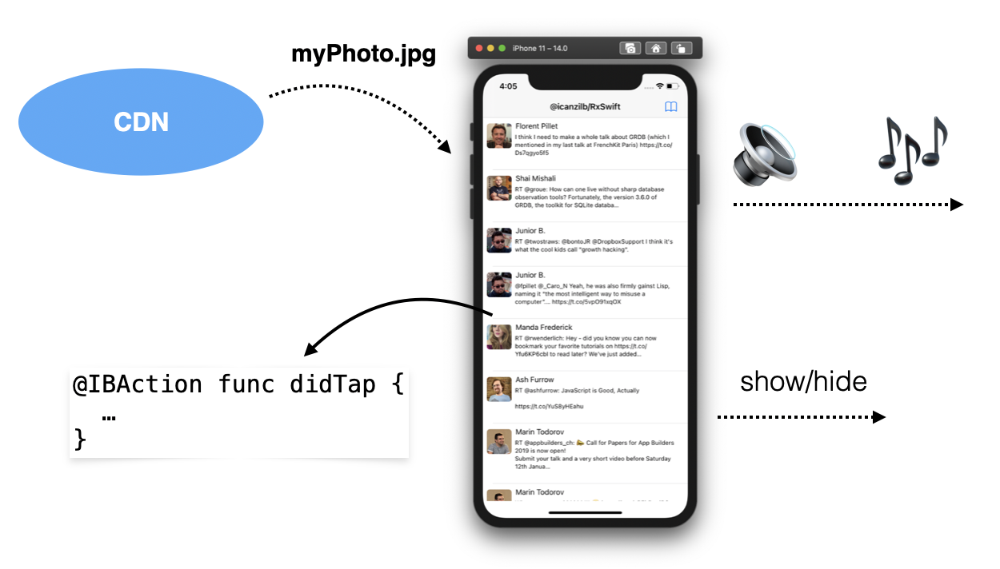
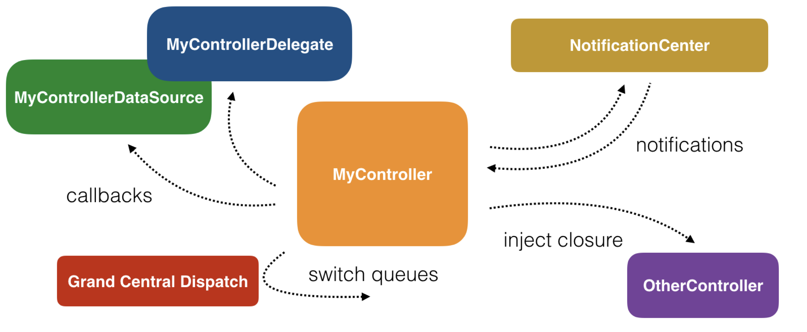
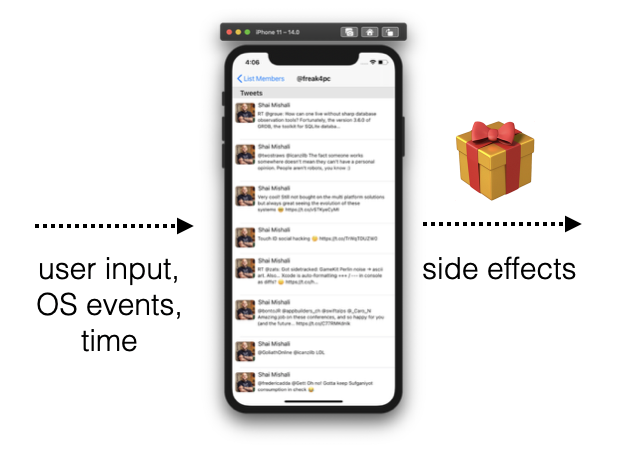
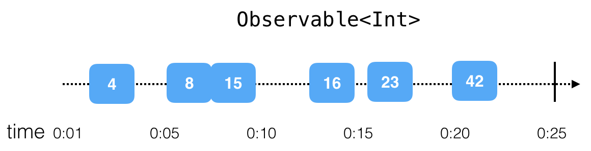
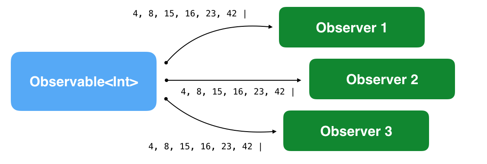
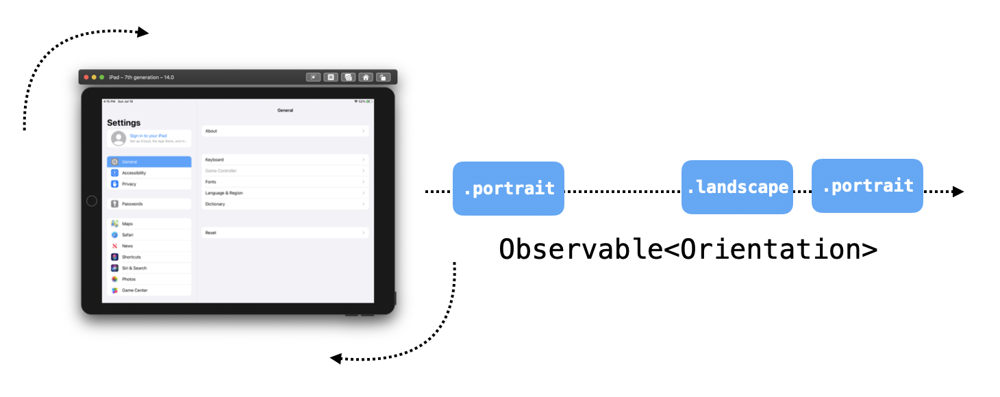
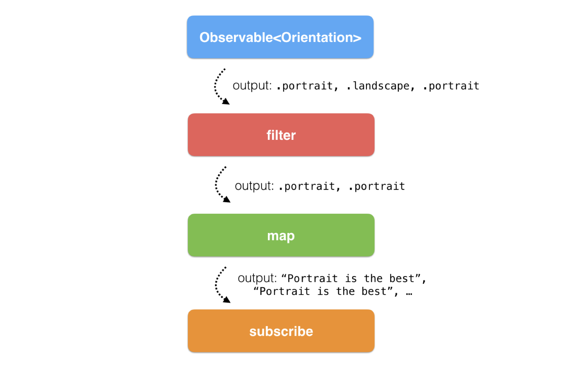
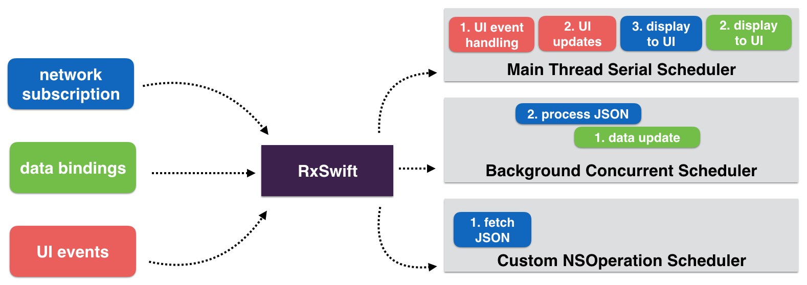
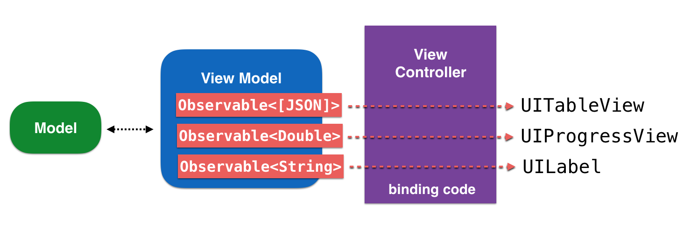
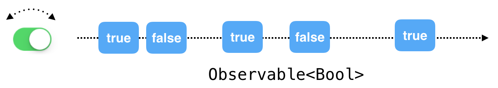

# Chapter 1: Hello RxSwift 

## RxSwift

옵저버블 시퀀스 및 함수 스타일 연산자를 사용하여,

 비동기 및 이벤트 기반 코드를 작성하기위한 라이브러리

스케줄러를 통해 매개 변수화된 실행을 허용

본질적으로 RxSwift는, 

코드가 새로운 데이터에 반응하고 순차적으로 격리 된 방식으로 처리 할 수 있도록 함

비동기 프로그램 개발을 단순화

# 1.1 비동기 프로그래밍 소개



- 버튼 탭에 반응
- 텍스트 필드가 포커스를 잃을 때 키보드 애니메이션
- 인터넷으로부터 큰 사진 다운로드
- 디스크에 데이터 비트 저장
- 오디오 재생

→ 이 모든 일들이 동시에 일어나는 것처럼 보임

→ 키보드가 화면 밖으로 애니메이션될 때마다 앱의 오디오는 애니메이션이 끝날 때까지 일시 중지되지 않음

→ 프로그램의 모든 비트는 서로 실행을 차단하지 않음

→ iOS는 서로 다른 스레드에서 서로 다른 작업을 수행하고 장치 CPU의 서로 다른 코어에서 수행할 수 있는 모든 종류의 API를 제공함

그러나, 실제로 병렬로 실행되는 코드를 작성하는 것은 다소 복잡하다

특히 서로 다른 코드 비트가 동일한 데이터 조각으로 작업해야하는 경우

어떤 코드가 먼저 데이터를 업데이트하는지 또는 어떤 코드가 최신 값을 읽었는지 알기 어려움

## Cocoa 및 UIKit 비동기 API

Apple은 항상 비동기 코드 작성에 도움이되는 수많은 API를 iOS SDK에 제공했다

- NotificationCenter

    사용자가 기기의 방향을 변경하거나 화면에 표시되거나 숨겨지는 소프트웨어 키보드와 같은 관심 이벤트가 발생할 때마다 코드를 실행

- Delegate Pattern

    다른 개체를 대신하거나 조정하여 작동하는 개체를 정의

- Grand Central DIspatch

    작업 실행을 추상화하는 데 도움

    코드 블록이 순차적으로, 동시에 또는 지정된 지연 후에 실행되도록 예약 가능

- Closures

    코드에서 전달할 수 있는 분리 된 코드 조각

- Combine

    iOS 13에서 도입되고 사용 가능한 Swift로 반응형 비동기 코드를 작성하기 위한 Apple의 자체 프레임워크

대부분의 일반적인 클래스는 비동기식으로 수행되며 모든 UI 구성 요소는 기본적으로 비동기적이기 때문에 앱 코드 전체가 어떤 순서로 실행되는지 가정할 수 없다.

결국, 앱의 코드는 사용자 입력, 네트워크 활동 또는 기타 OS 이벤트와 같은 다양한 외부 요인에 따라 다르게 실행된다. 사용자가 앱을 실행할 때마다 외부 요인에 따라 코드가 완전히 다른 순서로 실행될 수 있다. (앱을 테스트하는 로봇 무리의 경우를 제외하고, 모든 이벤트가 정밀한 킬봇 동기화로 발생할 것으로 예상할 수 있다.)

우리는 확실히 좋은 비동기식 코드를 쓰는 것이 불가능하다고 말하는 것은 아니다. 결국, 위에 나열된 Apple의 훌륭한 API는 매우 진보적이고, 작업에 매우 전문적이며, 공정하고, 다른 플랫폼이 제공하는 것에 비해 상당히 강력하다.

그러나 문제는, Apple의 SDK가 제공하는 다양한 API 때문에 복잡한 비동기 코드를 부분적으로 쓰기가 어렵다.



예를 들어 델리게이트 패턴 또는 알림 센터와 같은 일부 오

래된 Apple API를 사용하는 경우 주어진 시간에 앱의 상태를 일관되게 유지하기 위해 많은 노력을 기울여야 한다.

(Apple의 Combine을 사용하는 빛나는 새 코드베이스가 있다면 (물론) 이미 반응형 프로그래밍을 사용하고있는 것입니다. 축하합니다.)

이 섹션을 마무리하고 토론을 좀 더 컨텍스트로 만들기 위해 동기 코드와 비동기 코드를 비교할 예정

## 동기 코드

배열의 각 요소에 대해 작업을 수행하는 것: 동기식으로 실행 되고, 컬렉션은 반복하는 동안 변경할 수 없음

→ 컬렉션을 반복 할 때 모든 요소가 아직 있는지 확인할 필요가 없으며, 다른 스레드가 컬렉션의 시작 부분에 요소를 삽입하는 경우 되감을 필요가 없음

```swift
var array = [1, 2, 3]
for number in array {
  print(number)
  array = [4, 5, 6]
}
print(array)
```

- for 루프 안에서 배열의 값이 변경 되는가?
- 루프가 반복하는 컬렉션은 항상 변경 되는가?
- 모든 명령의 실행 순서는? 숫자를 변경할 수 있는가?

### 비동기 코드

버튼을 탭하는 것에 대한 반응으로 반복이 발생한다고 가정

```swift
var array = [1, 2, 3]
var currentIndex = 0

// This method is connected in Interface Builder to a button
@IBAction private func printNext() {
  print(array[currentIndex])
  
  if currentIndex != array.count - 1 {
    currentIndex += 1
  }
}
```

사용자가 버튼을 탭하면 배열의 모든 요소가 인쇄되는가? 

확신할 수 없다. 또 다른 비동기 코드가 배열이 출력되기 전에 마지막 요소를 제거할 수 있다.

또는 다른 코드로 이동한 후 컬렉션 시작 부분에 새 요소를 삽입할 수도 있다.

또한 currentIndex만 변경 되는 것이 아니라, 다른 코드도 수정될 수도 있다.

비동기 코드 작성의 핵심 문제 중 일부는 다음과 같다.

1. 작업이 수행되는 순서
2. 공유 변경 가능한 데이터

## 비동기 프로그래밍 용어집

RxSwift의 일부 언어는 비동기식, 반응형 또는 함수형 프로그래밍에 매우 밀접하게 연결되어 있으므로 다음 기본 용어를 먼저 이해하면 더 쉬울 것이다.

### 1. Shared mutable state

예시로, 노트북을 처음 시작하면 정상적으로 작동한다. 그러나 며칠 또는 몇 주 동안 사용하면 이상하게 작동하거나 갑자기 멈출 수 있다. 

이 때 하드웨어와 소프트웨어는 동일하게 유지되지만, 변경된 것은 상태이다.

재시동하면 같은 조합의 하드웨어와 소프트웨어가 정상적으로 동작한다.

- 메모리의 데이터
- 디스크에 저장된 데이터
- 사용자 입력에 대한 반응의 인공 산물
- 클라우드 서비스에서 더에이터를 가져온 후 남아있는 모든 추적

이들이 당신의 노트북의 상태이다.

여러 비동기 구성 요소 간에 공유되는 앱의 상태를 관리하는 것이 이 책에서 배우게 될 문제이다.

### 2. Imprerative programming

명령형 프로그래밍이란 명령문을 사용하여 프로그램의 상태를 변경하는 프로그래밍 패러다임이다.

ex) 강아지를 훈련시킬 때 '엎드려!', '손!', '기다려!'

명령형 코드를 사용하여 작업을 수행하는 시기와 방법을 앱에 정확히 알려준다.

CPU가 수행하는 모든 작업은 간단한 명령의 긴 시퀀스를 따르는 것. 

명령형 프로그래밍은 컴퓨터가 이해하는 방법과 유사하다. 

문제는 사람이 복잡한 비동기 앱을 위한 명령형 코드를 작성 하는 것이 어려워 진다는 것이다.

특히 공유된 변경 가능 상태를 처리하는 것이 그렇다.

```swift
override func viewDidAppear(_ animated: Bool) {
  super.viewDidAppear(animated)

  setupUI()
  connectUIControls()
  createDataSource()
  listenForChanges()
}
```

- 이 메서드들이 무엇을 하는지 알 수 없다
- 뷰 컨트롤러 자체의 속성을 업데이트 하는가?
- 올바른 순서로 호출되는가? 누군가의 실수로 메서드 호출의 순서를 바꾸어 다르게 동작할 수 있다.

### 3. Side effects

사이드 이펙트는 코드의 현재 범위를 벗어난 상태의 모든 변경을 의미한다.

예시로 주어진 위 코드에서

- `connectUIContols()` 일부 UI component에 일종의 이벤트 핸들러를 첨부할 경우

→ 뷰의 상태가 변경됨. 사이드 이펙트 발생

→ 앱은 `connectUIContols()` 실행 전과 후가 다르게 동작함

- 디스크에 저장된 데이터를 수정
- 화면의 레이블 텍스트를 업데이트

→ 사이드 이펙트 발생

결국 사이드 이펙트를 일으키는 것이 모든 프로그램의 궁극적인 목표.

프로그램이 실행된 후 어떻게 해서든지 상태를 바꿀 필요가 있다. 아무 일도 하지 않는 것은 쓸모 없는 앱이 된다



사이드 이펙트 생성의 중요한 측면은 통제된 방식으로 수행하는 것

어떤 코드가 사이드 이펙트를 일으키는지, 어떤 코드가 단순히 데이터를 처리/출력하는지 확인할 수 있어야 함

### 4. Declarative code

명령형 프로그래밍에서는 마음대로 상태를 변경한다.

함수형 프로그래밍에서는 사이드 이펙트를 일으키는 코드를 최소화하는 것을 목표로 한다.

RxSwift는 이 두 가지 프로그래밍의 가장 좋은 측면을 결합했다

선언적 코드를 사용하면 동작의 일부를 정의 할 수 있다

RxSwift는 관련 이벤트가있을 때마다 이러한 동작을 실행하고 작업 할 불변의 독립된 데이터 조각을 제공

이렇게하면 비동기 코드로 작업 할 수 있지만 단순 for 루프에서와 동일한 가정을 할 수 있음 (변경 불가능한 데이터, 순차적이고 결정적인 방식의 코드 실행)

### 5. Reactive systems

- Responsive: 항상 앱 상태를 나타내는 UI를 최신으로 유지
- Resilient: 각 동작은 독립되어 정의. 유연한 오류 복구 제공
- Elastic: 코드는 다양한 워크로드로 처리됨. lazy pull-driven data collections, event throttling, resouce sharing
- Message driven: component는 향상된 재사용 및 독립을 위해 메시지 기반 통신을 사용하여 lifecycle과 클래스 구현을 분리한다

# 1.2 RxSwift의 기초

반응형 프로그래밍은 새로운 개념이 아니다. 꽤 오랫동안 사용되어 왔지만 학샘 개념은 근 10년 간 눈에 띄게 주목받았다. 그 기간동안 웹앱은 복잡한 비동기 UI 관리 문제와 마주했다

MicroSoft의 한 팀에서 비동기, 확장 가능한 실시간 앱 개발의 문제를 해결하는데 도전했다

.NET 용 Rx는 2012 년부터 오픈 소스가되어 다른 언어와 플랫폼이 동일한 기능을 다시 구현할 수있게하여 Rx를 플랫폼 간 표준으로 전환했다

오늘날 RxJS, RxKotlin, [Rx.NET](http://rx.net/), RxScala, RxSwift 등이 존재하고 모두 Reactive Extensions 사양을 기반으로 동일한 동작과 동일한 표현 API를 구현하고자 한다

RxSwift는 전통적으로 필수적인 코코아 코드와 순수 기능 코드 사이의 달콤한 지점을 찾는다. 이를 통해 고정 코드 정의를 사용하여 비동기로 입력 조각을 결정적이고 구성 가능한 방식으로 처리함으로써 이벤트에 대응할 수 있게 된다

Rx 구현 제품군에 대한 자세한 내용은 [http://reactivex.io에서](http://reactivex.xn--io-q04jk9m/) 확인할 수 있다. Rx의 연산자 및 코어 클래스에 대한 문서의 중앙 저장소이며 Rx 로고, 전기 뱀장어(이 책의 표지에서 볼 수 있는 약간 더 사실적인 이미지)를 가장 먼저 볼 수 있다


Rx 코드의 세 가지 구성 요소는 다음과 같다:

 `observables` , `operators`, `schedulers`

## Observables

`Observable<T>` 클래스는 데이터 T의 불변의 스냅샷을 "전달"할 수 있는 일련의 이벤트를 비동기적으로 생성하는 기능이다.

시간이 지남에 따라 다른 클래스가 발생시키는 값에 대한 클래스 가입을 허용한다.

한 개 이상의 옵저버가 모든 이벤트에 실시간으로 반응하여 앱 UI를 업데이트 하거나, 

새로운 데이터와 들어오는 데이터를 처리하고 활용할 수 있도록 한다.

`ObservableType` 프로토콜은 매우 간단하다.

`Observable` 은 오직 세 가지 유형의 이벤트만 내보내거나 수신할 수 있다.

1. A `next` event

    최신 또는 "다음" 데이터 값을 "전달"하는 이벤트이다. 옵저버는 값을 "인식"한다.

2. A `completed` event

    이벤트 시퀀스를 성공적으로 종료시킨다. `Observable` 이 life-cycle을 성공적으로 완료햇으며 다른 이벤트를 발생시키지 않는다는 의미이다.

3. An `error` event

    오류로 종료되면 다른 이벤트를 내보내지 않는다.

비동기 이벤트에 대한 타임 라인을 다음과 같이 시각화할 수 있다.



클래스가 서로 통신 할 수 있도록 델리게이트 프로토콜을 사용하거나 클로저를 삽입 할 필요가 없다.



실제 상황에 대한 아이디어를 얻으려면 두 가지 유형의 관찰 가능한 시퀀스인 `finite` 와 `infinite` 를 살펴보아야 한다.

### 1. Finite observable sequneces

iOS 앱에서 인터넷으로부터 파일을 다운로드하는 코드를 보자.

1. 먼저 다운로드를 시작하고 들어오는 데이터를 관찰한다
2. 파일의 일부가 도착할 때 박복적으로 데이터 덩어리를 받는다
3. 네트워크 연결이 끊어지면 다운로드가 중지되고 오류와 함께 연결 시간이 초과된다
4. 또는 코드가 모든 파일의 데이터를 다운로드하면 성공적으로 완료된다

이 워크플로우는 일반적인 observable의 생명 주기를 정학하게 설명한다.

```swift
API.download(file: "http://www...")
   .subscribe(
     onNext: { data in
      // Append data to temporary file
     },
     onError: { error in
       // Display error to user
     },
     onCompleted: {
       // Use downloaded file
     }
   )
```

1.  `API.download(file:)` 는 데이터 덩어리가 네트워크를 통해 들어올 때 데이터 값을 내보내는 `Observable<Data>` 인스턴스를 반환한다.
2. `onNext` 클로저를 제공하여 `next` event를 수행한다. 다운로드 예제에서는 디스크에 저장된 임시 파일에 데이터를 추가하는 작업이다.
3. `onError` 클로저를 제공하여 에러를 받아보도록 한다. `error.localizedDescription` 을 표시하는 등의 작업이 가능하다.
4. 완료된 이벤트를 처리하기 위해 새 뷰 컨트롤러를 눌러 다운로드한 파일 또는 앱에서 지시하는 내용을 표시할 수 있는 `onCompleted` 클로저를 제공한다.

### 2. Infinite observable sequences

파일 다운로드와 같은 활동과 달리, 단순히 무한한 시퀀스도 있습니다.

UI 이벤트는 종종 무한한 observable 시퀀스입니다.

예를 들어 앱의 기기 방향 변경에 반응하는 데 필요한 코드를 보자.

1. `NotificationCenter` 의 `UIDeviceOrientationDidChange` 알림에 옵저버로 클래스를 추가한다.
2. 방향 변경을 처리하기 위해 메서드 콜백을 제공해야 한다. 현재 방향을 `UIDevice` 에서 가져와 최신 값에 따라 반응해야 한다.

기기 방향 변경 반응에는 끝이 정해져 있지 않다.

시퀀스는 사실상 무한하고 상태가 있으므로 관찰을 시작할 때 항상 초기 값을 갖게 된다.



→ 사용자가 기기를 회전하지 않는 경우가 있지만 그렇다고 이벤트 시퀀스가 종료되는 것은 아니고, 이벤트가 발생하지 않을 뿐이다.

```swift
UIDevice.rx.orientation
  .subscribe(onNext: { current in
    switch current {
    case .landscape:
      // Re-arrange UI for landscape
    case .portrait:
      // Re-arrange UI for portrait
    }
  })
```

→ `UIDevice.rx.orientation` 을 생성하는 가상의 제어 속성으로, `Observalbe<Orientation>` 을 구독하고 현재 방향에 따라 앱 UI를 업데이트한다.

이러한 이벤트는 옵저버블에서 무한하기 때문에 `onError` 및 `onCompeleted` 파라미터를 건너뛴다.

## Operators

옵저버블 클래스 구현에는 복잡한 논리를 구현하기 위해 함께 구성될 수 있는 비동기 작업 및 이벤트 조작의 개별 부분을 추상화하는 많은 메서드가 포함된다.

이러한 메서드는 매우 독립적으로 구성 가능하기 때문에 이러한 메서드를 `Operator` 라고 한다.

연산자는 비동기 입력을 받아들이고 사이드 이펙트없이 출력만 생성하기 때문에 퍼즐 조각처럼 서로 맞물려 더 큰 조각을 만들어낼 수 있다.

예를 들어 다음과 같은 수학적 표현이 있다: `(5 + 6) * 10 - 2`

연산자 `*`, `( )`, `+` 및 `-`를 미리 정의된 순서대로 입력 데이터 조각에 적용하고 출력을 취하여 식이 해결될 때까지 계속 처리할 수 있다.

입출력을 처리하도록 옵저버블 입력 부분에 식이 결과 값을 낼 때 까지 Rx 오퍼레이터를 사용하도록 적용할 수 있다. 오퍼레이터를 사용하여 사이드 이펙트를 발생시킬 수 있다.

```swift
UIDevice.rx.orientation
  .filter { $0 != .landscape }
  .map { _ in "Portrait is the best!" }
  .subscribe(onNext: { string in
    showAlert(text: string)
  })
```

`UIDevice.rx.orientation` 이  `.landscape` 또는 `.portrait` 값을 생성할 때 마다 RxSwift는 두 개의 연산자를 해당 데이터에 적용한다.



1. `filter` 는 `.landscape` 가 아닌 값만 통과시킨다. 기기가 가로 모드인 경우 이러한 이벤트를 표시하지 않으므로 코드가 실행되지 않는다.
2. `.portrait` 값의 경우 `map` 오퍼레이터는 방향 유형 입력을 가져와 문자열 출력으로 변환한다. - "Portarait is the best!" 라는 텍스트
3. 마지막으로 `subscribe` 을 통해 다음 이벤트인 문자열 값을 전송하고 메소드를 호출하여 해당 텍스트를 화면에 표시한다.

## Schedulers

스케줄러는 Rx가 dispatch queue 또는 equivalent queue와 동일하다.

특정 작업의 실행 컨텍스트를 정의할 수 있어 사용하기 훨씬 더 쉽다.

예를 들어 Grand Central Dispatch를 사용하여 주어진 queue에서 코드를 순서화하는 `SerialDispatchQueueScheduler` 에서 다음 이벤트를 관찰하도록 지정할 수 있다.

`ConcurrentDispatchQueueScheduler` 는 코드를 동시에 실행한다. `OperationQueueScheduler` 를 사용하면 지정된 `NSOperationQueue` 에서 구독을 예약할 수 있다.

RxSwift는 `subscrption` 과 `scheduler` 사이에서 발송자 역할을 하여 작업 내용을 올바른 컨텍스트로 전송하고 서로의 출력으로 원활하게 작업할 수 있도록 한다.



1. `network subscription` 은 "사용자 지정 `NSOperation` 기반 스케줄러"에서 실행되는 코드로 시작한다.
2. 이 블록에 의한 데이터 출력은 다른 스케줄러에서 실행되는 다음 블록의 입력 역할을 하며, 이는 "concurrent background GCD queue"에서 실행된다.
3. "Main thread scheduler"에서 새 데이터로 UI를 업데이트하기 위해 마지막 블록이 schedule 된다.

# 1.3 앱 아키텍처

RxSwift와 `MVVM 아키텍처` 는 특히 잘 어울린다. 

ViewModel을 사용하면 `Observable<T>` 프로퍼티를 드러낼 수 있으므로 ViewController의 glue code에서 UIKit 컨트롤에 직접 바인딩 할 수 있다.

이렇게하면 모델 데이터를 UI에 매우 간단하게 표현하고 코딩할 수 있다.



# 1.4 RxCocoa

UIKit 및 Cocoa의 개발을 지원하는 모든 클래스를 포함하는 RxSwift의 companion library

다양한 UI 이벤트를 subscribe할 수 있도록 많은 UI 구성 요소에 reactive extension을 추가한다.

예를 들어 RxCocoa를 사용하여 `UISwitch` 의 상태 변경을 subscribe 하는 것은 매우 쉽다.

```swift
toggleSwitch.rx.isOn
  .subscribe(onNext: { isOn in
    print(isOn ? "It's ON" : "It's OFF")
  })
```

`rx.isOn` 속성을 `UISwitch` 클래스에 추가하여 유용한 이벤트를 옵저버블 시퀀스로 subscribe



또한 RxCocoa는 `UITextField`, `URLSession` , `UIViewController` 등에 `rx` 네임스페이스를 추가할 수 있다.

# 1.5 RxSwift 설치

### CocoaPods

```swift
use_frameworks!

target 'MyTargetName' do
  pod 'RxSwift', '~> 5.1'
  pod 'RxCocoa', '~> 5.1'
end
```

### Carthage

```swift
github "ReactiveX/RxSwift" ~> 5.1
```

# 1.6 RxSwift 및 Combine

### Combine

Apple의 자체 reactive 프레임워크

Rxswift와 Combine은 매우 유사한 개념을 공유한다.

# 1.7 커뮤니티

[http://community.rxswift.org](http://community.rxswift.org/)

RxSwift 커뮤니티는 패턴, 일반적인 기술에 대해 토론하거나 서로 돕는 것에 대해 매우 친절하고 개방적이며 열정적이다.

더 많은 Rx 라이브러리와 실험은 여기에서 찾을 수 있습니다 : [https://github.com/RxSwiftCommunity](https://github.com/RxSwiftCommunity)

RxSwift에 관심이있는 많은 사람들을 만나는 가장 좋은 방법은 라이브러리 전용 Slack 채널이다 :  [http://slack.rxswift.org](http://slack.rxswift.org/)

# 1.8 Where to go from here?