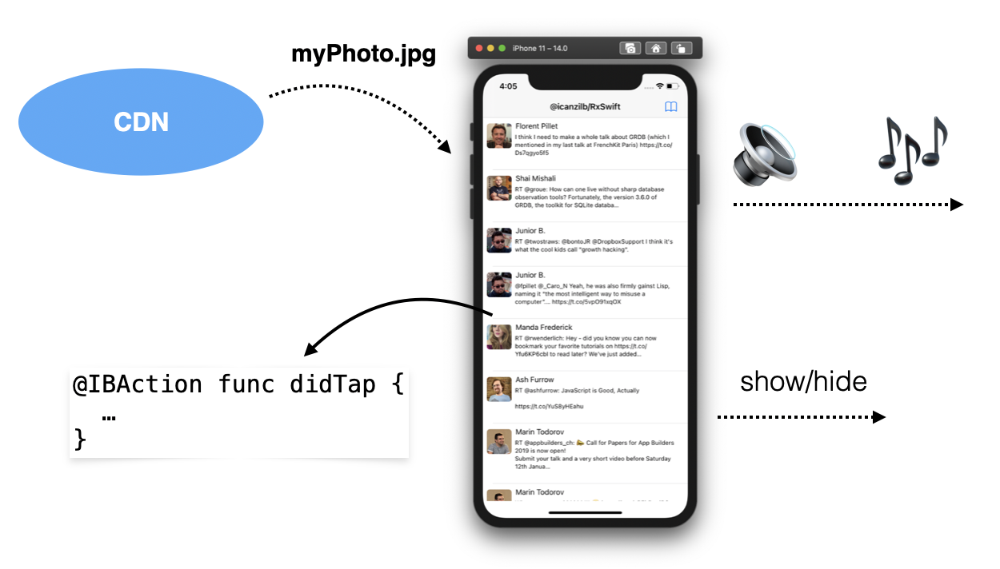
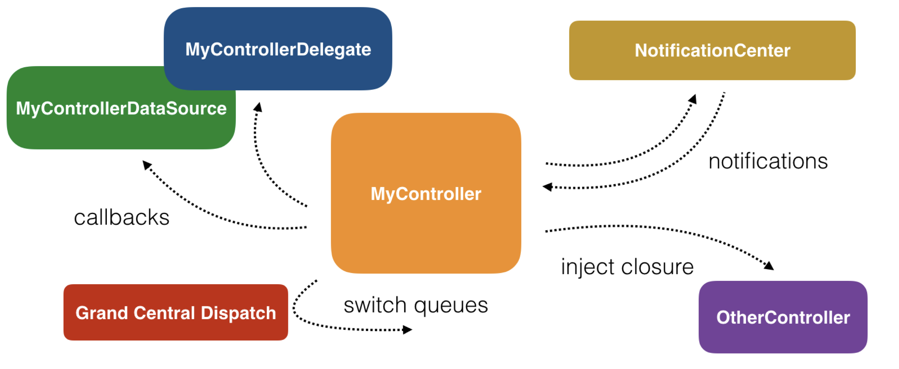

# Section 1: Getting Started with RxSwift

# Chapter 1: Hello RxSwift

## RxSwift

옵저버블 시퀀스 및 함수 스타일 연산자를 사용하여,

 비동기 및 이벤트 기반 코드를 작성하기위한 라이브러리

스케줄러를 통해 매개 변수화된 실행을 허용

본질적으로 RxSwift는, 

코드가 새로운 데이터에 반응하고 순차적으로 격리 된 방식으로 처리 할 수 있도록 함

비동기 프로그램 개발을 단순화

## 비동기 프로그래밍 소개



- 버튼 탭에 반응
- 텍스트 필드가 포커스를 잃을 때 키보드 애니메이션
- 인터넷으로부터 큰 사진 다운로드
- 디스크에 데이터 비트 저장
- 오디오 재생

→ 이 모든 일들이 동시에 일어나는 것처럼 보임

→ 키보드가 화면 밖으로 애니메이션될 때마다 앱의 오디오는 애니메이션이 끝날 때까지 일시 중지되지 않음

→ 프로그램의 모든 비트는 서로 실행을 차단하지 않음

→ iOS는 서로 다른 스레드에서 서로 다른 작업을 수행하고 장치 CPU의 서로 다른 코어에서 수행할 수 있는 모든 종류의 API를 제공함

그러나, 실제로 병렬로 실행되는 코드를 작성하는 것은 다소 복잡하다

특히 서로 다른 코드 비트가 동일한 데이터 조각으로 작업해야하는 경우

어떤 코드가 먼저 데이터를 업데이트하는지 또는 어떤 코드가 최신 값을 읽었는지 알기 어려움

## Cocoa 및 UIKit 비동기 API

Apple은 항상 비동기 코드 작성에 도움이되는 수많은 API를 iOS SDK에 제공했다

- NotificationCenter

    사용자가 기기의 방향을 변경하거나 화면에 표시되거나 숨겨지는 소프트웨어 키보드와 같은 관심 이벤트가 발생할 때마다 코드를 실행

- Delegate Pattern

    다른 개체를 대신하거나 조정하여 작동하는 개체를 정의

- Grand Central DIspatch

    작업 실행을 추상화하는 데 도움

    코드 블록이 순차적으로, 동시에 또는 지정된 지연 후에 실행되도록 예약 가능

- Closures

    코드에서 전달할 수 있는 분리 된 코드 조각

- Combine

    iOS 13에서 도입되고 사용 가능한 Swift로 반응형 비동기 코드를 작성하기 위한 Apple의 자체 프레임워크

대부분의 일반적인 클래스는 비동기식으로 수행되며 모든 UI 구성 요소는 기본적으로 비동기적이기 때문에 앱 코드 전체가 어떤 순서로 실행되는지 가정할 수 없다.

결국, 앱의 코드는 사용자 입력, 네트워크 활동 또는 기타 OS 이벤트와 같은 다양한 외부 요인에 따라 다르게 실행된다. 사용자가 앱을 실행할 때마다 외부 요인에 따라 코드가 완전히 다른 순서로 실행될 수 있다. (앱을 테스트하는 로봇 무리의 경우를 제외하고, 모든 이벤트가 정밀한 킬봇 동기화로 발생할 것으로 예상할 수 있다.)

우리는 확실히 좋은 비동기식 코드를 쓰는 것이 불가능하다고 말하는 것은 아니다. 결국, 위에 나열된 Apple의 훌륭한 API는 매우 진보적이고, 작업에 매우 전문적이며, 공정하고, 다른 플랫폼이 제공하는 것에 비해 상당히 강력하다.

그러나 문제는, Apple의 SDK가 제공하는 다양한 API 때문에 복잡한 비동기 코드를 부분적으로 쓰기가 어렵다.



예를 들어 델리게이트 패턴 또는 알림 센터와 같은 일부 오래된 Apple API를 사용하는 경우 주어진 시간에 앱의 상태를 일관되게 유지하기 위해 많은 노력을 기울여야 한다.

(Apple의 Combine을 사용하는 빛나는 새 코드베이스가 있다면 (물론) 이미 반응형 프로그래밍을 사용하고있는 것입니다. 축하합니다.)

이 섹션을 마무리하고 토론을 좀 더 컨텍스트로 만들기 위해 동기 코드와 비동기 코드를 비교할 예정

## 동기 코드

배열의 각 요소에 대해 작업을 수행하는 것: 동기식으로 실행 되고, 컬렉션은 반복하는 동안 변경할 수 없음

→ 컬렉션을 반복 할 때 모든 요소가 아직 있는지 확인할 필요가 없으며, 다른 스레드가 컬렉션의 시작 부분에 요소를 삽입하는 경우 되감을 필요가 없음

```swift
var array = [1, 2, 3]
for number in array {
  print(number)
  array = [4, 5, 6]
}
print(array)
```

- for 루프 안에서 배열의 값 변경 불가
- 루프가 끝난 후에도 값은 변화 없음
- 모든 명령의 실행 순서는? 숫자를 변경할 수 있는가?

### 비동기 코드

버튼을 탭하는 것에 대한 반응으로 반복이 발생한다고 가정

```swift
var array = [1, 2, 3]
var currentIndex = 0

// This method is connected in Interface Builder to a button
@IBAction private func printNext() {
  print(array[currentIndex])
  
  if currentIndex != array.count - 1 {
    currentIndex += 1
  }
}
```

사용자가 버튼을 탭하면 배열의 모든 요소가 인쇄되는가? 

확신할 수 없다. 또 다른 비동기 코드가 배열이 출력되기 전에 마지막 요소를 제거할 수 있다.

또는 다른 코드로 이동한 후 컬렉션 시작 부분에 새 요소를 삽입할 수도 있다.

또한 currentIndex만 변경 되는 것이 아니라, 다른 코드도 수정될 수도 있다.

비동기 코드 작성의 핵심 문제 중 일부는 다음과 같다.

1. 작업이 수행되는 순서
2. 공유 변경 가능한 데이터